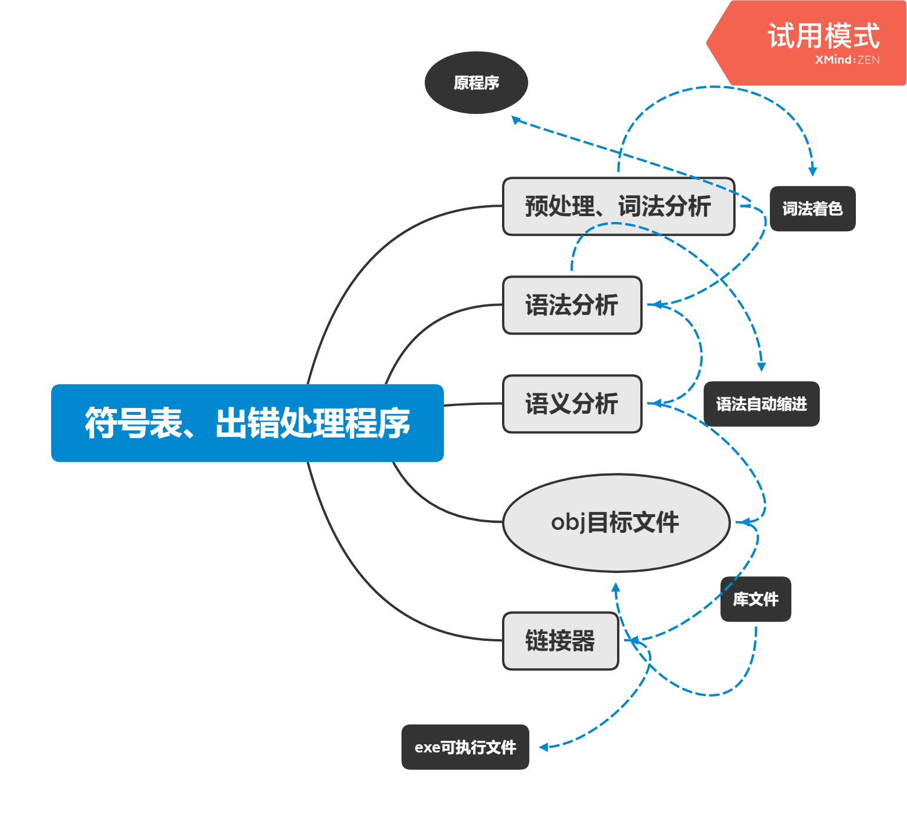

## 引言
### c语言程序的入口
在Visual C++下，控制台程序的入口函数是mainCRTStartup，由mainCRTStartup调用用户编写的main函数。
图形用户界面(GUI)下是由WinMainCRTStartup调用用户编写的WinMain函数。
mainCRTStartup和WinMainCRTStartup都封装在已经编译好的lib库中。
### 分析
词法分析-->语法分析-->语义分析
### 链接器
将.obj与C运行时库链接生成.exe可执行文件。
## SC编译器简介

### 编译器运行环境
x86指令集处理器，Intel 8086/808/80186/80286 CPU都是16位处理器。1985年，推出32位80386。
## SC语言定义
K&RC-->C89-->C99
## 词法分析
